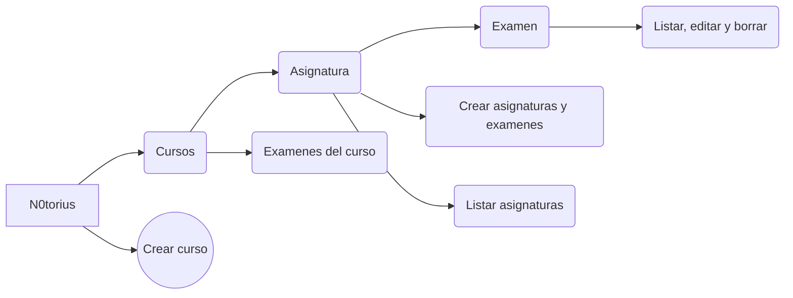

# N0torius

Mhw - wiki es una wiki local del juego Monster Hunter World. Esta guía nos permite ver las estadisticas de los monstruos ( resistencias a los elementos ) y un listado de los items de los monstruos introducidos asi como su probabilidad de obtenerlos

Los items salen listados y pueden ser filtrado por el nombre del monstruo

Una vez seleccionado a el monstruo que queremos ver nos saldrá por pantalla : 
1. Una imagen del monstruo
2. Una descripción detallada del mismo

	
	
3. Gráfia con las estadísticas del monstruo ( resistencias a los elementos )
4. Gráfica con los ratios de drops de los items del monstruo

Funcionamiento de la aplicación:

