# N0torius

## Funcionamiento

N0torius es una aplicación desarollada en ionic para el proyecto del primer trimestre de AD.

N0torius es un gestor académico que nos permite crear cursos, asignaturas y examenes. Estos ultimos pueden ser borrados y editados.

La aplicación tiene como objetivo 

|            | Cantidad|
|------------|---------|
|Página	     |    7    |
|Servicios   |    5    |
|Modelos     |    3    |

## Capturas

### Inicio de la aplicacion 

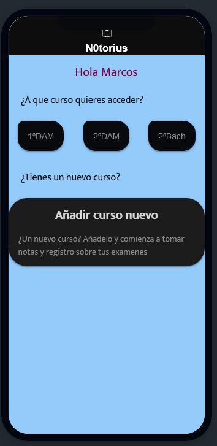

### Curso 

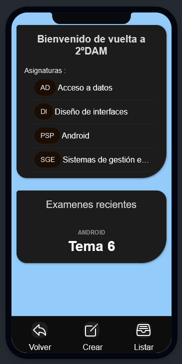
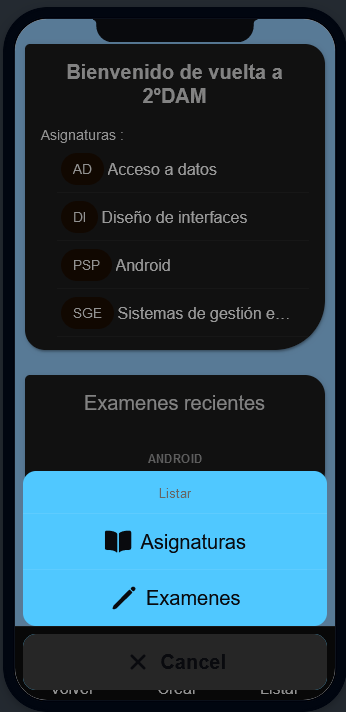

### Asignatura

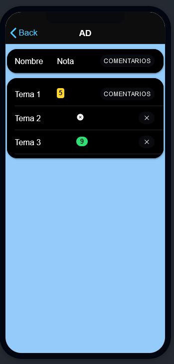

### Examen

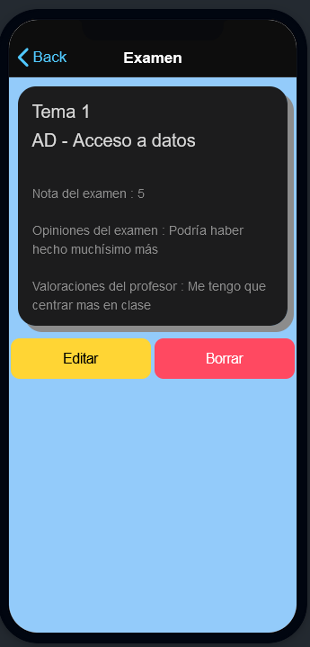
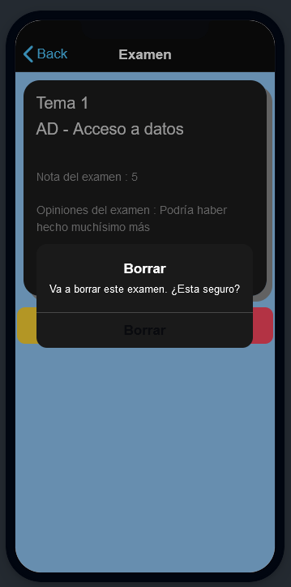

### Editar

### Lista

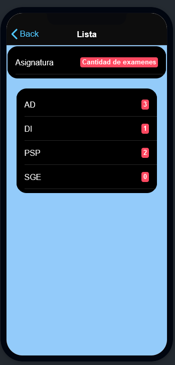
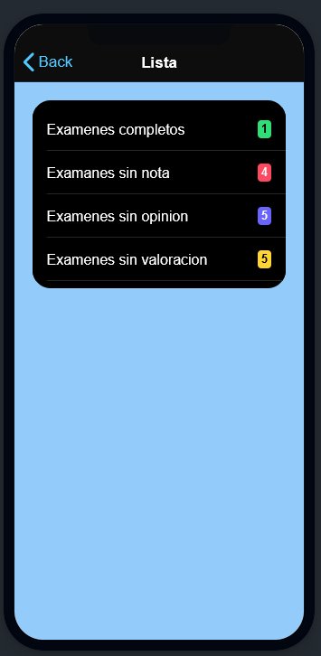

### Crear

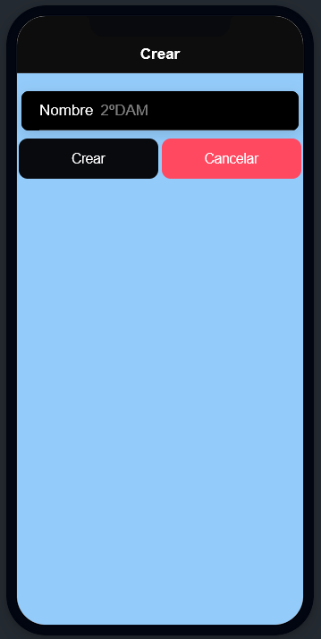
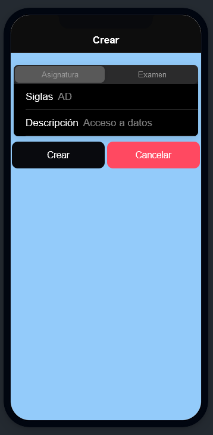
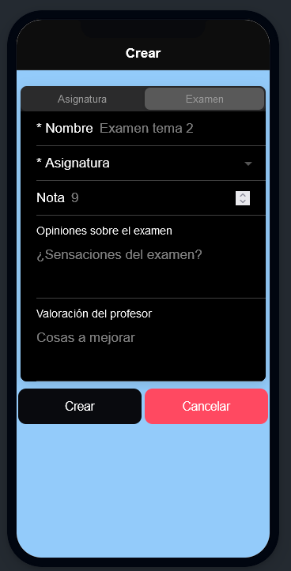
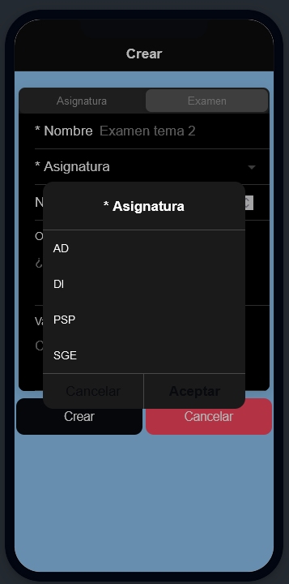

## Esquema

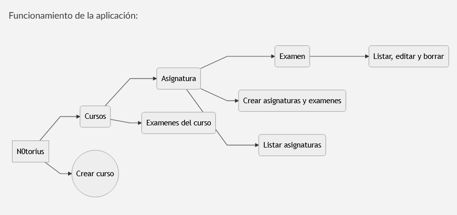
