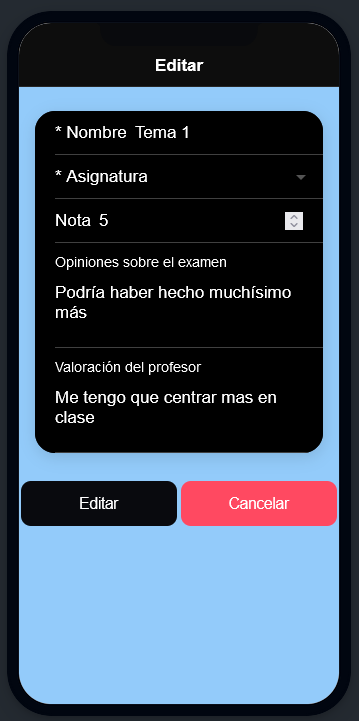

# N0torius

N0torius es un sistema de gestión de notas para el ambito académico. Nos permite crear : cursos, asignaturas y examenes . Aparte los examenes son editables y pueden ser borrados

|            | Cantidad|
|------------|---------|
|Página	     |    7    |
|Servicios   |    5    |
|Modelos     |    3    |

## Capturas

Inicio de la aplicacion 

Inicio de curso 

Inicio asignatura

Inicio examen

Inicio editar

